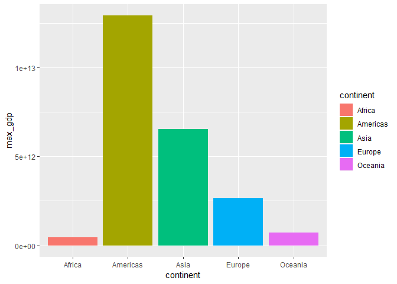
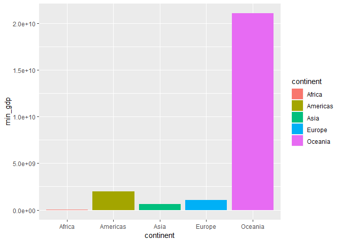
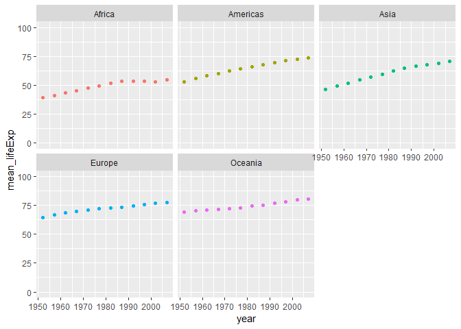
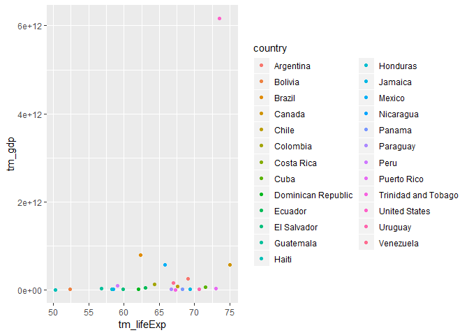
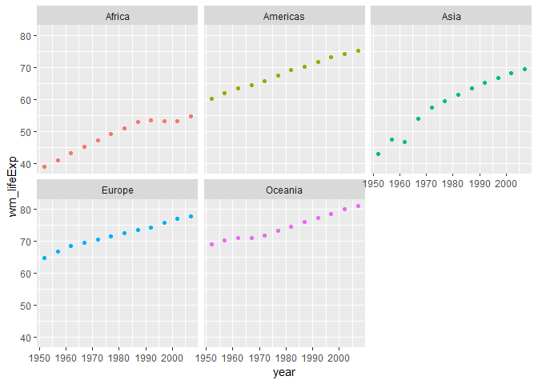

hw03-gapminder
================

``` r
suppressPackageStartupMessages(library("tidyverse"))
suppressPackageStartupMessages(library("ggplot2"))
suppressPackageStartupMessages(library("gapminder"))
```

### Task 1:

To get the max and min of gdp per continent:

``` r
summary_gdp <- gapminder %>% 
  mutate(gdp = gdpPercap * pop) %>% 
  group_by(continent) %>% 
  summarize(max_gdp = max(gdp),
            min_gdp = min(gdp))

knitr::kable(summary_gdp)
```

| continent |      max\_gdp|     min\_gdp|
|:----------|-------------:|------------:|
| Africa    |  4.479709e+11|     52784691|
| Americas  |  1.293446e+13|   2003975797|
| Asia      |  6.539501e+12|    629774980|
| Europe    |  2.650871e+12|   1075341715|
| Oceania   |  7.036584e+11|  21058193787|

``` r
summary_gdp %>% 
  ggplot(aes(continent, max_gdp, fill = continent)) +
  geom_bar(stat = "identity") # height of a bar will be equal to the value in df
```



Africa has the lowest maximum gdp over the years, followed by Oceania. Americas have the highest maximum gdp.

``` r
summary_gdp %>% 
  ggplot(aes(continent, min_gdp, fill = continent)) +
  geom_bar(stat = "identity") # height of a bar will be equal to the value in df
```



Oceania has a much higher minimum gdp compared to the other continents; Africa has the lowest minimum gdp.

### Task 2:

How is life expectancy changing over time on different continents?

``` r
lifeExp_vs_time <- gapminder %>% 
  group_by(continent, year) %>% 
  summarize(mean_lifeExp = mean(lifeExp))

knitr::kable(lifeExp_vs_time)
```

| continent |  year|  mean\_lifeExp|
|:----------|-----:|--------------:|
| Africa    |  1952|       39.13550|
| Africa    |  1957|       41.26635|
| Africa    |  1962|       43.31944|
| Africa    |  1967|       45.33454|
| Africa    |  1972|       47.45094|
| Africa    |  1977|       49.58042|
| Africa    |  1982|       51.59287|
| Africa    |  1987|       53.34479|
| Africa    |  1992|       53.62958|
| Africa    |  1997|       53.59827|
| Africa    |  2002|       53.32523|
| Africa    |  2007|       54.80604|
| Americas  |  1952|       53.27984|
| Americas  |  1957|       55.96028|
| Americas  |  1962|       58.39876|
| Americas  |  1967|       60.41092|
| Americas  |  1972|       62.39492|
| Americas  |  1977|       64.39156|
| Americas  |  1982|       66.22884|
| Americas  |  1987|       68.09072|
| Americas  |  1992|       69.56836|
| Americas  |  1997|       71.15048|
| Americas  |  2002|       72.42204|
| Americas  |  2007|       73.60812|
| Asia      |  1952|       46.31439|
| Asia      |  1957|       49.31854|
| Asia      |  1962|       51.56322|
| Asia      |  1967|       54.66364|
| Asia      |  1972|       57.31927|
| Asia      |  1977|       59.61056|
| Asia      |  1982|       62.61794|
| Asia      |  1987|       64.85118|
| Asia      |  1992|       66.53721|
| Asia      |  1997|       68.02052|
| Asia      |  2002|       69.23388|
| Asia      |  2007|       70.72848|
| Europe    |  1952|       64.40850|
| Europe    |  1957|       66.70307|
| Europe    |  1962|       68.53923|
| Europe    |  1967|       69.73760|
| Europe    |  1972|       70.77503|
| Europe    |  1977|       71.93777|
| Europe    |  1982|       72.80640|
| Europe    |  1987|       73.64217|
| Europe    |  1992|       74.44010|
| Europe    |  1997|       75.50517|
| Europe    |  2002|       76.70060|
| Europe    |  2007|       77.64860|
| Oceania   |  1952|       69.25500|
| Oceania   |  1957|       70.29500|
| Oceania   |  1962|       71.08500|
| Oceania   |  1967|       71.31000|
| Oceania   |  1972|       71.91000|
| Oceania   |  1977|       72.85500|
| Oceania   |  1982|       74.29000|
| Oceania   |  1987|       75.32000|
| Oceania   |  1992|       76.94500|
| Oceania   |  1997|       78.19000|
| Oceania   |  2002|       79.74000|
| Oceania   |  2007|       80.71950|

``` r
lifeExp_vs_time %>% 
  ggplot(aes(year, mean_lifeExp, colour = continent)) +
  geom_point() +
  facet_wrap(~continent) +
  theme(legend.position="none") +  # removes the legend
  ylim(0, 100) # sets the limits for the y-axis - will be the same range 0-100 for all continents
```



``` r
#The first two continents don't seem to have x-axis labels; probaby because there are plots with the same axis below
```

Mean life expectancy over time is increasing in all continents. Africa has the lowest mean life expectancy; Oceania has the highest.

### Task 3:

Find countries with interesting stories:

``` r
am_gdp <- gapminder %>%
  filter(continent == "Americas") %>%
  group_by(country) %>%
  mutate(gdp = gdpPercap*pop) %>%
  summarize(tm_gdp = mean(gdp, 0.1), # trim the mean by removing 20% of the gdp cases (top 10% and bottom 10%)
            tm_lifeExp = mean(lifeExp, 0.1)) %>% 
  arrange(tm_gdp) # from low to high

knitr::kable(am_gdp)
```

| country             |       tm\_gdp|  tm\_lifeExp|
|:--------------------|-------------:|------------:|
| Trinidad and Tobago |  7.797553e+09|      67.2974|
| Haiti               |  8.509812e+09|      50.3488|
| Nicaragua           |  9.545788e+09|      58.4980|
| Honduras            |  1.119182e+10|      58.2940|
| Panama              |  1.202087e+10|      68.2893|
| Paraguay            |  1.223434e+10|      66.7308|
| Costa Rica          |  1.376598e+10|      70.6189|
| Jamaica             |  1.396322e+10|      69.3895|
| Bolivia             |  1.672346e+10|      52.4087|
| Dominican Republic  |  1.685200e+10|      62.0491|
| El Salvador         |  1.973176e+10|      59.8460|
| Uruguay             |  2.041337e+10|      70.6924|
| Guatemala           |  2.847605e+10|      56.8471|
| Puerto Rico         |  3.611209e+10|      72.9846|
| Ecuador             |  5.028973e+10|      63.0451|
| Cuba                |  5.716485e+10|      71.4847|
| Chile               |  7.609783e+10|      67.5873|
| Peru                |  9.919745e+10|      59.0989|
| Colombia            |  1.224873e+11|      64.3241|
| Venezuela           |  1.530601e+11|      67.0133|
| Argentina           |  2.580340e+11|      69.0920|
| Canada              |  5.727380e+11|      74.9430|
| Mexico              |  5.736656e+11|      65.7922|
| Brazil              |  7.893803e+11|      62.3567|
| United States       |  6.162322e+12|      73.5060|

``` r
am_gdp %>%
  ggplot(aes(tm_lifeExp, tm_gdp, colour = country)) +
  geom_point()
```



United States has much bigger gdp mean over the years compared to the other countries and one of the highest life expectancies.

### Task 4:

Compute a weighted mean of life expectancy, weighting by population:

``` r
wm_df <- gapminder %>%
  group_by(continent, year) %>% 
  summarize(wm_lifeExp = weighted.mean(lifeExp, pop))

knitr::kable(wm_df)
```

| continent |  year|  wm\_lifeExp|
|:----------|-----:|------------:|
| Africa    |  1952|     38.79973|
| Africa    |  1957|     40.94031|
| Africa    |  1962|     43.09925|
| Africa    |  1967|     45.17721|
| Africa    |  1972|     47.21229|
| Africa    |  1977|     49.20883|
| Africa    |  1982|     51.01744|
| Africa    |  1987|     52.82479|
| Africa    |  1992|     53.37292|
| Africa    |  1997|     53.28327|
| Africa    |  2002|     53.30314|
| Africa    |  2007|     54.56441|
| Americas  |  1952|     60.23599|
| Americas  |  1957|     62.01806|
| Americas  |  1962|     63.43706|
| Americas  |  1967|     64.50630|
| Americas  |  1972|     65.70490|
| Americas  |  1977|     67.60591|
| Americas  |  1982|     69.19264|
| Americas  |  1987|     70.35814|
| Americas  |  1992|     71.72177|
| Americas  |  1997|     73.19154|
| Americas  |  2002|     74.24736|
| Americas  |  2007|     75.35668|
| Asia      |  1952|     42.94114|
| Asia      |  1957|     47.28835|
| Asia      |  1962|     46.57369|
| Asia      |  1967|     53.88261|
| Asia      |  1972|     57.52159|
| Asia      |  1977|     59.55648|
| Asia      |  1982|     61.57472|
| Asia      |  1987|     63.53710|
| Asia      |  1992|     65.14874|
| Asia      |  1997|     66.77092|
| Asia      |  2002|     68.13732|
| Asia      |  2007|     69.44386|
| Europe    |  1952|     64.90540|
| Europe    |  1957|     66.89364|
| Europe    |  1962|     68.45957|
| Europe    |  1967|     69.54963|
| Europe    |  1972|     70.46884|
| Europe    |  1977|     71.53989|
| Europe    |  1982|     72.56247|
| Europe    |  1987|     73.44717|
| Europe    |  1992|     74.44273|
| Europe    |  1997|     75.70849|
| Europe    |  2002|     77.02232|
| Europe    |  2007|     77.89057|
| Oceania   |  1952|     69.17040|
| Oceania   |  1957|     70.31693|
| Oceania   |  1962|     70.98808|
| Oceania   |  1967|     71.17848|
| Oceania   |  1972|     71.92273|
| Oceania   |  1977|     73.25684|
| Oceania   |  1982|     74.58291|
| Oceania   |  1987|     75.98107|
| Oceania   |  1992|     77.35788|
| Oceania   |  1997|     78.61843|
| Oceania   |  2002|     80.16006|
| Oceania   |  2007|     81.06215|

``` r
wm_df %>% 
  ggplot(aes(year, wm_lifeExp, colour = continent)) +
  geom_point() +
  facet_wrap(~continent) +
  theme(legend.position="none")   # removes the legend
```



Weighted mean of life expectancy for Africa over the years is lower compared to the other continent; Oceania still has the highest life expectancy. In Asia, there is a dip in life expectancy in the early 1960's - something that was not seen on the previous plot of lifeExp vs year.
